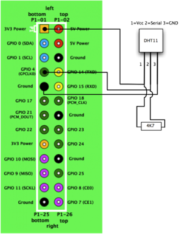
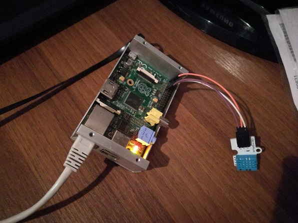
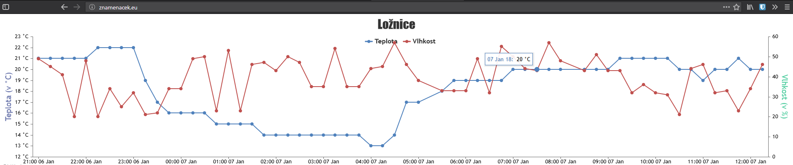

# Raspberry Pi: Teplotní čidlo
Implementace domácího IoT teploměru s webovým rozhraním na Raspberry Pi

test

## Cíle projektu:
1) Nastudovat dokumentaci k vybranému teploměru
2) Vytvořit program na pravidelné čtení hodnot
3) Vytvořit výstup z programu, ke bude možno zjistit aktuální teplotu (např. webserver, Twitter API, e-mail, LED)

## Vybrané čidlo:
Původně jsme použili pro projekt jednoduché digitální teplotní čidlo, které jsme však v průběhu vývoje špatně zapojili, čímž jsme jej spálili. Proto jsme pořídili čidlo nové, a vzhledem k tomu, že máme zájem tento IoT teploměr dále používat pro monitorování nejen teploty, ale i vlhkosti, použili jsme nakonec čidlo DHT11.
Technická dokumentace k tomuto čidlu je obsažena v tomto repozitáři [zde](DHT11.pdf).

## Zapojení
Snímač jsme k Raspberry připojili pomocí GPIO podle dokumentace následujícím způsobem:

Schéma                                                       |Fotografie
:-----------------------------------------------------------:|----------------------------------------------
 | 

Datová linka je připojena ke GPIO portu 4, ze kterého je vstup následně čten.

## Program na čtení hodnot
Vzhledem k tomu, že v Pythonu dostupná knihovna pro čtení dat z tohoto snímače, i robustní knihovna pro práci s GPIO vstupy na RPi, rozhodli jsme se tento jazyk použít. Následující kód má na starost čtení dat z čidla:

```python
instance = dht11.DHT11(pin=4)

repeat = 100
while repeat:
    result = instance.read()
    if result.is_valid():
        repeat = 0
        try:
            #Connect to database, insert the values
        except:
            print("Error connecting to DB")
    else:
        repeat = repeat - 1
        
```

Vzhledem k nedostatkům v komunikaci se vždy nepodaří napoprvé přečíst správnou hodnotu teploty a vlhkosti, proto program zkouší číst opakovaně, dokud nedostane správné hodnoty (maximálně však 100x)

## CRON úloha
Pro pravidelné čtení je opakovaně volaný zmíněný skript. K tomu je použit démon Cron s následující definicí:
```
*/15 * * * * python /home/pi/app/app.py
```
## Databáze
Jak již bylo zmíněno, data jsou ukládána do databáze. Tato databáze je hostována lokálně na Raspberry, a jedná se konkrétně o MySQL MariaDB databázi.
Pro přístup do databáze jsme vytvořili dva uživatelské účty, jeden výhradně se čtecími právy, používaný webovou aplikací, a druhý pouze se zapisovacími právy, používaný čtecím skriptem.

Databáze má jednoduchou strukturu, pouze jednu entitu se třemi atributy, časem čtení a naměřenou teplotou a vlhkostí.

## Webový server

Na Raspberry běží Apache server, který zajišťuje spuštění PHP skriptu na získání dat z databáze a poskytuje vzdálenému prohlížeči uživatelské rozhraní obsahující graf vývoje teplot. Toto zobrazení je realizováno s pomocí knihoven jQuery a CanvasJS.

Výňatek z PHP skriptu:
```PHP
$sql = "SELECT log_time, temp, humidity FROM log ORDER BY log_time DESC  LIMIT 0, 60";
$result = $conn->query($sql);

while ($row = $result->fetch_assoc()) {
    echo "[";
$cas =  $row['log_time'];
$temp = $row['temp'];
$hum = $row['humidity'];
echo '"'.$cas.'"';
echo ", {$row['temp']}, {$row['humidity']}],";
}

echo '["'.$cas.'",'.$temp.','.$hum.']]';
```

Výsledný graf ukazuje vývoj teploty a vlhkosti za posledních 15 hodin:



Raspberry je přístupné na doméně [znamenacek.eu](http://znamenacek.eu/).
K dispozici je také čistý textový výstup zveřejněné části dat, dostupná jako OpenData, a to [zde](http://znamenacek.eu/dateDB.php).
